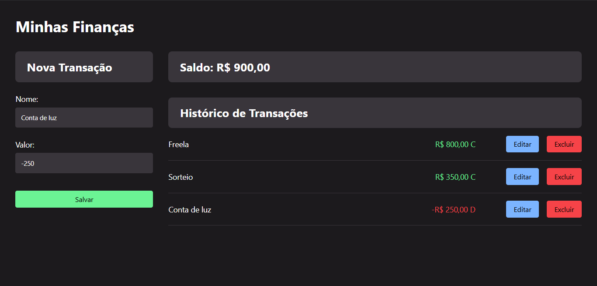

# Personal Finances - Onebitcode

A simple web app to track income and expenses using API methods (GET, POST, PUT, DELETE) with JSON Server.

## Features
- Add, update, and delete financial transactions
- Responsive UI
- Uses API methods (GET, POST, PUT, DELETE)

# Tech Stack
- Frontend: HTML5, CSS, Javascript
- Backend: Node.js, JSON Server

### Download and Setup

```bash
  git clone https://github.com/EzzFelt/Personal-finances
```

```bash
 cd Personal-finances
```

### Install Dependencies

```bash
 npm install
```

### Start the JSON Server

```bash
npm run serve
```

###  API Endpoints

| Method | Endpoint            | Description                 |
|--------|---------------------|-----------------------------|
| GET    | `/transactions`     | Get all transactions       |
| POST   | `/transactions`     | Add a new transaction      |
| PUT    | `/transactions/:id` | Update a transaction       |
| DELETE | `/transactions/:id` | Delete a transaction       |

## Screenshots


## Thanks for reading, and please leave a star ❤️
